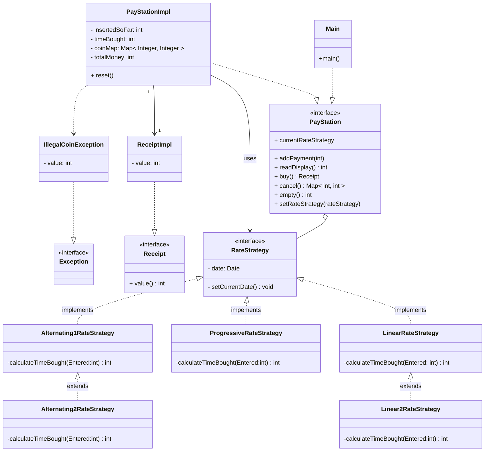

```mermaid
%% Define all Classes and Interfaces
classDiagram
class PayStation
<< interface >> PayStation
class PayStationImpl
class ReceiptImpl
class Receipt
<< interface >> Receipt
class IllegalCoinException
class Exception
<< interface >> Exception
class RateStrategy
<< interface >> RateStrategy
class LinearRateStrategy
class ProgressiveRateStrategy
class Alternating1RateStrategy
class Alternating2RateStrategy
class Linear2RateStrategy
class Main

%% Provide Attributes and Methods
class PayStation {
    + addPayment(int)
    + readDisplay() int
    + buy() Receipt
    %% Spaces are needed between < > in mermaid for some reason.       👇   👇
    + cancel() Map< int, int > 
    + empty() int
    + currentRateStrategy
    + setRateStrategy(rateStrategy)
}

class PayStationImpl {
    - insertedSoFar: int
    - timeBought: int
    - coinMap: Map< Integer, Integer >
    - totalMoney: int
    + reset()
}

class Receipt {
    + value() int
}

class ReceiptImpl {
    - value: int
}

class IllegalCoinException {
    - value: int
}

class RateStrategy {
    - date: Date
    - setCurrentDate() void
}
class LinearRateStrategy{
    -calculateTimeBought(Entered: int) int

}
class ProgressiveRateStrategy{
    -calculateTimeBought(Entered:int) int
}
class Alternating1RateStrategy{
    -calculateTimeBought(Entered:int) int
}
class Alternating2RateStrategy{
    -calculateTimeBought(Entered:int) int
}
class Linear2RateStrategy{
    -calculateTimeBought(Entered:int) int
}
class Main{
    +main()
}

%% Define relationships
Main ..|> PayStation
PayStationImpl ..|> PayStation
PayStationImpl --> RateStrategy : uses
    RateStrategy <|.. LinearRateStrategy:implements
    RateStrategy <|.. ProgressiveRateStrategy: impements
    RateStrategy <|.. Alternating1RateStrategy: implements
    LinearRateStrategy <|.. Linear2RateStrategy: extends
    Alternating1RateStrategy <|.. Alternating2RateStrategy: extends

%% Multiplicity only seems to render in Chrome based browsers as of 09/12/24. Graders should make sure to view Mermaid there.  
PayStationImpl "1"-->"1" ReceiptImpl
PayStationImpl ..> IllegalCoinException
PayStation o--RateStrategy
ReceiptImpl ..|> Receipt
IllegalCoinException ..|> Exception
```
